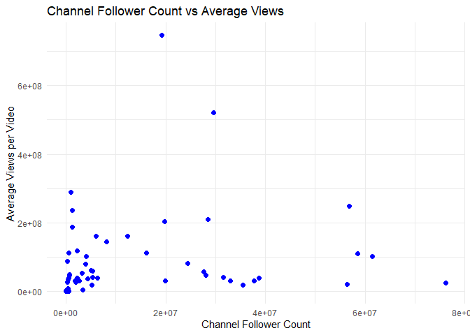

Youtube Music Video Analysis
================
Christopher Luke
2025-10-09

Goal: Investigate data set containing information on the top 100 music
videos on YouTube in 2025. This approach will utilize R to load,
transform and visualize trends such as popularity rank while also
observing potential relationships between channel follower count and
video views.

Data Source: https://www.kaggle.com/datasets/eshummalik/yt-trends

Libraries used: dplyr and ggplot2

Loading csv file and transforming it into a data frame

``` r
library(dplyr)
```

    ## 
    ## Attaching package: 'dplyr'

    ## The following objects are masked from 'package:stats':
    ## 
    ##     filter, lag

    ## The following objects are masked from 'package:base':
    ## 
    ##     intersect, setdiff, setequal, union

``` r
library(ggplot2)
path <- "C:/Users/chris/OneDrive/Desktop/youtube-top-100-songs-2025.csv"
tibble <- read.csv(path)
glimpse(tibble)
```

    ## Rows: 100
    ## Columns: 13
    ## $ title                  <chr> "ROSÉ & Bruno Mars - APT. (Official Music Video…
    ## $ fulltitle              <chr> "ROSÉ & Bruno Mars - APT. (Official Music Video…
    ## $ description            <chr> "ROSÉ & Bruno Mars - APT.\nDownload/stream: htt…
    ## $ view_count             <int> 2009014557, 1324833300, 2536628, 558329099, 211…
    ## $ categories             <chr> "Music", "Music", "Music", "Music", "Music", "M…
    ## $ tags                   <chr> "YG Entertainment;YG;와이지;K-pop;BLACKPINK;블랙핑크;블…
    ## $ duration               <int> 173, 252, 160, 231, 180, 201, 269, 183, 221, 26…
    ## $ duration_string        <chr> "2:53", "4:12", "2:40", "3:51", "3:00", "3:21",…
    ## $ live_status            <chr> "False", "False", "False", "False", "False", "F…
    ## $ thumbnail              <chr> "https://i.ytimg.com/vi_webp/ekr2nIex040/maxres…
    ## $ channel                <chr> "ROSÉ", "Lady Gaga", "Reneé Rapp", "Billie Eili…
    ## $ channel_url            <chr> "https://www.youtube.com/channel/UCBo1hnzxV9rz3…
    ## $ channel_follower_count <int> 19200000, 29600000, 408000, 56800000, 408000, 1…

Transforming data frame, including sorting by view count descending and
creating a corresponding rank column, and calculating average viewer
count per channel

``` r
tibble <- tibble %>% arrange(channel, desc(view_count))
tibble <- tibble %>% mutate(rank = rank(-view_count))
avgviewsperchannel <- tibble %>% group_by(channel) %>% summarise (avgviews = mean(view_count), count = n(), channel_follower_count = first(channel_follower_count))
head(avgviewsperchannel,10)
```

    ## # A tibble: 10 × 4
    ##    channel             avgviews count channel_follower_count
    ##    <chr>                  <dbl> <int>                  <int>
    ##  1 Addison Rae        35211939      1                4350000
    ##  2 Alex Warren       100298525      2                4050000
    ##  3 Ariana Grande      18705800.     2               56400000
    ##  4 Benson Boone       57853069      2                5360000
    ##  5 Billie Eilish     249079867.     3               56800000
    ##  6 C'zah                 12089      1                   1320
    ##  7 Chappell Roan     118077070      1                2250000
    ##  8 Charli xcx         79002814      1                3900000
    ##  9 Chxnny                 6605      1                   3630
    ## 10 Claudia Valentina    667846      1                  23900

Visualizing results and fitting a linear regression model to understand
potential relationships **Showing code and referencing figure through
github**

``` r
ggplot(avgviewsperchannel, aes(x = channel_follower_count, y = avgviews)) +
  geom_point()
```

<figure>

<figcaption aria-hidden="true">Channel Follower vs Average
Views</figcaption>
</figure>

``` r
linearmodel <- lm(avgviews ~ channel_follower_count, data = avgviewsperchannel)
summary(linearmodel)
```

    ## 
    ## Call:
    ## lm(formula = avgviews ~ channel_follower_count, data = avgviewsperchannel)
    ## 
    ## Residuals:
    ##        Min         1Q     Median         3Q        Max 
    ## -139483220  -59971949  -34902493   13757085  660952359 
    ## 
    ## Coefficients:
    ##                         Estimate Std. Error t value Pr(>|t|)   
    ## (Intercept)            5.998e+07  1.812e+07   3.310  0.00154 **
    ## channel_follower_count 1.350e+00  8.240e-01   1.638  0.10645   
    ## ---
    ## Signif. codes:  0 '***' 0.001 '**' 0.01 '*' 0.05 '.' 0.1 ' ' 1
    ## 
    ## Residual standard error: 121700000 on 63 degrees of freedom
    ## Multiple R-squared:  0.04084,    Adjusted R-squared:  0.02561 
    ## F-statistic: 2.682 on 1 and 63 DF,  p-value: 0.1064

Results summary provides statistics regarding the linear model, showing
a statistically insignificant relationship between a channel’s follower
count and its average video reviews

